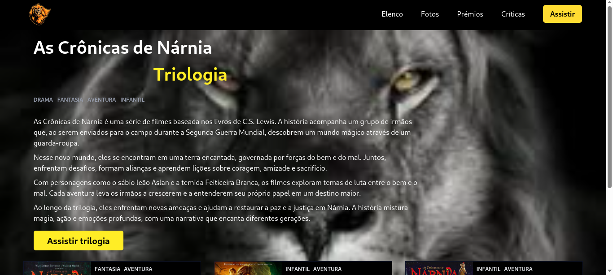

  <h1>Página sobre a triologia Crônicas de Nárnia </h1>
  

     
     
   

   

Este projeto consiste em uma página simples dedicada à trilogia Crônicas de Nárnia. A página é responsiva, o que significa que se adapta tanto a dispositivos móveis quanto a desktops. Além disso, os botões possuem um efeito visual que muda de cor quando são sobrepostos pelo cursor.

  
Desenvolvido por <a target="_blank" rel="external" href="https://github.com/MegMinnie/"><strong>Mirele Oliveira da Silva</strong></a>

 

  ## Tecnologias ultilizadas
  
-   Tailwind CSS;
-   React.js;
-   TypeScript;

  
  ## Como Acessar a Aplicação

Acesse a aplicação por meio do link: <a href="https://cronicas-narnia.vercel.app/
"_blank">clique aqui</a>

## Screenshots
**Versão desktop**

    

 
**Versão mobile**
 

